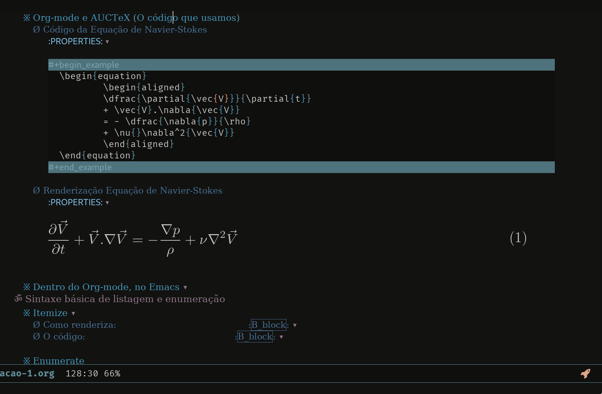

# Table of Contents

1.  [Sumário de tópicos](#org66af3f8)
    1.  [Pioneiros e Fundadores](#orge274be8)
        1.  [Origem de TeX - Knuth (1978)](#org4a2c4f7)
        2.  [Roupagem moderna, LaTeX - Leslie Lamport (1985)](#orgdd7aacc)
    2.  [Aplicações que utilizam de LaTeX](#org656df28)
        1.  [MathJax - LaTeX na Web](#org4e0951a)
        2.  [Org-mode e AUCTeX (O código que usamos)](#org1595ca1)
        3.  [Dentro do Org-mode, no Emacs](#orge81bcb6)
    3.  [Sintaxe básica de listagem e enumeração](#orgf958a0c)
        1.  [Itemize](#orgbe747f4)
        2.  [Enumerate](#org42db0cb)
    4.  [Tabelas](#org2db89c4)
        1.  [Tabela Simples](#org664dedf)
2.  [Exemplos de documentos completos](#org9bcbdc0)
    1.  [Preâmbulo](#org65ae31f)
        1.  [Preâmbulo mínimo](#orgdadc4d2)
        2.  [Os pacotes a serem utilizados](#org9871fdc)
        3.  [Corpo do documento](#org0eb0002)
3.  [Tabela](#orgd2bd05e)

# Sumário de tópicos

## Pioneiros e Fundadores

### Origem de TeX - Knuth (1978)

1.  Imagem do Knuth

    

2.  Código Imagem

        \begin{figure}[!ht]
          \centering
          \includegraphics[width=\linewidth]
                          {./img/Knuth.png}
        \end{figure}

### Roupagem moderna, LaTeX - Leslie Lamport (1985)

1.  Imagem Lamport

    

2.  Código da Imagem

        \begin{figure}[!ht]
          \centering
          \includegraphics[width=\linewidth]
                          {./img/Lamport.png}
        \end{figure}

## Aplicações que utilizam de LaTeX

### MathJax - LaTeX na Web

### Org-mode e AUCTeX (O código que usamos)

1.  Código da Equação de Navier-Stokes

        \begin{equation}
                \begin{aligned}
                \dfrac{\partial{\vec{V}}}{\partial{t}}
                + \vec{V}.\nabla{\vec{V}}
                = - \dfrac{\nabla{p}}{\rho}
                + \nu{}\nabla^2{\vec{V}}
                \end{aligned}
        \end{equation}

2.  Renderização Equação de Navier-Stokes

    \begin{equation}
            \begin{aligned}
            \dfrac{\partial{\vec{V}}}{\partial{t}} + \vec{V}.\nabla{\vec{V}} = - \dfrac{\nabla{p}}{\rho} + \nu{}\nabla^2{\vec{V}}
            \end{aligned}
    \end{equation}

### Dentro do Org-mode, no Emacs

-   Preview em tempo real.
-   Aparência customizável.
-   Ecossistema para programação.

## Sintaxe básica de listagem e enumeração

### Itemize

1.  Como renderiza:     :B_block:

2.  O código:     :B_block:

        \begin{enumerate}
        \item Primeiro item
        \item Segundo item
        \end{enumerate}

### Enumerate

1.  Como renderiza:     :B_block:

2.  O código:     :B_block:

        \begin{enumerate}
        \item Primeiro item
        \item Segundo item
        \end{enumerate}

## Tabelas

### Tabela Simples

1.  Exemplo

    <table border="2" cellspacing="0" cellpadding="6" rules="groups" frame="hsides">
    
    
    <colgroup>
    <col  class="org-left" />
    
    <col  class="org-left" />
    
    <col  class="org-left" />
    </colgroup>
    <thead>
    <tr>
    <th scope="col" class="org-left">Coluna 1</th>
    <th scope="col" class="org-left">Coluna 2</th>
    <th scope="col" class="org-left">Coluna 3</th>
    </tr>
    </thead>
    
    <tbody>
    <tr>
    <td class="org-left">\(a_{11}\)</td>
    <td class="org-left">\(a_{12}\)</td>
    <td class="org-left">\(a_{13}\)</td>
    </tr>
    
    
    <tr>
    <td class="org-left">\(a_{21}\)</td>
    <td class="org-left">\(a_{22}\)</td>
    <td class="org-left">\(a_{23}\)</td>
    </tr>
    
    
    <tr>
    <td class="org-left">Texto 1</td>
    <td class="org-left">Texto 2</td>
    <td class="org-left">Texto 3</td>
    </tr>
    
    
    <tr>
    <td class="org-left">dsda</td>
    <td class="org-left">dsad</td>
    <td class="org-left">dasdas</td>
    </tr>
    </tbody>
    </table>

2.  Código

        \begin{center}
          \begin{tabular}{lll}
            \hline
            Coluna 1 & Coluna 2 & Coluna 3\\
            \hline
            \(a_{11}\) & \(a_{12}\) & \(a_{13}\)\\
            \(a_{21}\) & \(a_{22}\) & \(a_{23}\)\\
            Texto 1 & Texto 2 & Texto 3\\
            \hline
          \end{tabular}
        \end{center}

# Exemplos de documentos completos

## Preâmbulo

### Preâmbulo mínimo

-   Onde fica as especificações da tipografia do documentos.
-   Ambiente mais genérico.
-   Onde os comportamentos padrões são especificados.

1.  Definindo a classe do documento

        %!Tex TS-program = xelatex
        %!TEX encoding = UTF-8 Unicode
        
          \documentclass[
          12pt,				% tamanho da fonte
          openright,			% capítulos começam em pág ímpar (insere página vazia caso preciso)
          oneside,			% para impressão em recto e verso. Oposto a oneside
          a4paper,			% tamanho do papel.
          brazil,				% o último idioma é o principal do documento
          english,			% idioma adicional para hifenização
          ]{abntex2}
          \RequireXeTeX %Force XeTeX check

### Os pacotes a serem utilizados

1.  Alguns que definem fonte, indentação, etc.

        % --- (tudo que vem depois de '%' é um comentário em latex)
        % PACKAGES
        % ---
        
        % ---
        % Fundamental Packages
        % ---
        \usepackage{lmodern}			% Usa a fonte Latin Modern
        \usepackage[T1]{fontenc}		% Selecao de codigos de fonte.
        \usepackage[utf8]{inputenc}		% Codificacao do documento (conversão automática dos acentos)
        \usepackage{indentfirst}		% Indenta o primeiro parágrafo de cada seção.
        \usepackage{color}				% Controle das cores
        \usepackage{graphicx}			% Inclusão de gráficos
        \usepackage{microtype} 			% para melhorias de
        % justificação
        \usepackage{lipsum}
        \usepackage[alf]{abntex2cite}	% Citações padrão ABNT
        \usepackage{amsmath}            % Ambientes matemáticos

### Corpo do documento

1.  Um texto dentro do ambiente `document`

        \begin{document} %% Iniciar o documento
        
        \chapter{Capítulo 1}
          \section{Secção número 1.1}
        
            \textbf{De acordo com \cite{knuth1984literate}, Literate programming é
            o paradigma mais formal e divertido de todos.}
        
          \lipsum[1-2] % Gerador de texto enche linguíça
        
        \bibliography{arquivo-com-bibliografias} % Usar bibliografias
        
        \end{document}

# Tabela

    3+2

    3+2

    import numpy as np

    np.sin(2)

    np.ones(2)

